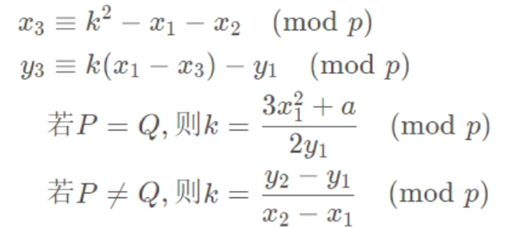

# 数学知识
## 群
群是指一个集合G和一个二元运算构成的代数结构，满足以下四个基本条件：

1.  封闭性：对于群G中的任意两个元素a和b，它们的运算结果ab也属于群G。

2.  结合律：对于群G中的任意三个元素a、b和c，它们的运算结果符合结合律，即(ab)c = a(bc)。

3.  存在单位元素：存在一个元素e属于群G，使得对于群G中的任意一个元素a，a乘以e的结果等于a，即ae = ea = a。

4.  存在逆元素：对于群G中的任意一个元素a，存在一个元素b属于群G，使得a乘以b的结果等于群G的单位元素e，即ab = ba = e。

此集合关于此二元运算形成了一个群(G,+)。 群的元素可以是数、集合、点坐标等
椭圆曲线一般用加法、乘法。

## 域
满足两个二元运算（加法、乘法）的群（加法和乘法各自构成一个群。）

### 有限域
也称为伽罗华域，是一种由有限个元素组成的域
元素的个数称为有限域的阶n, n一定是某个素数的正整数次幂, n = pᵐ , 标识为GF（pᵐ）
既要有限，就要取模。
x3 ≡ k² - x1 - x2 (mod p)
y3 ≡ k(x1 - x3) - y1 (mod p)
    

## 椭圆曲线
椭圆曲线是一种数学曲线：y² = x³ + ax + b的方程来描述，其中a和b是常数，且满足4a³ + 27b² ≠ 0 (保证曲线平滑，都有切点)。

椭圆曲线具有以下基础概念和性质：

1.点的坐标：椭圆曲线上的点可以用二元组（x，y）表示，其中x和y都是实数或复数。

2.垂直性质：椭圆曲线是对称于x轴和y轴的，也就是说，如果（x，y）是椭圆曲线上的一个点，那么（x，-y）和(-x，y)也是。

3.封闭性质：如果（x1，y1）和（x2，y2）是椭圆曲线上的点，那么它们的和（x3，y3）也是椭圆曲线上的点。

4.椭圆曲线的加法是通过从（x1，y1）和（x2，y2）开始，沿着曲线绘制一条直线，找到与曲线的第三个交点来计算的。

5.无穷远点：椭圆曲线上还有一个特殊的点，称为无穷远点，通常用O表示。
    它不在椭圆曲线上，在椭圆曲线的加法运算中，将无穷远点作为加法中的零元素，即任何点加上无穷远点等于其本身，无穷远点加上任何点等于该点本身。

6.群结构：椭圆曲线上的点满足一个群结构，可以进行加法和数乘（将一个整数乘以一个点）。

7.这个群结构具有封闭性、结合律、交换律、存在单位元素和逆元素等基本性质。

